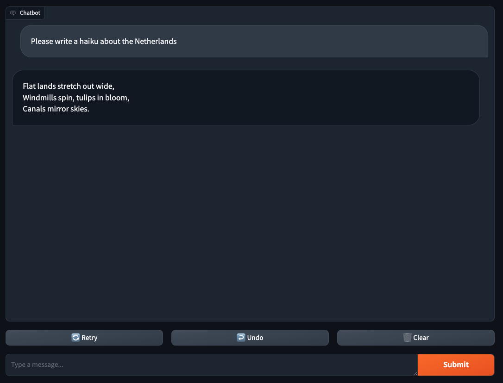
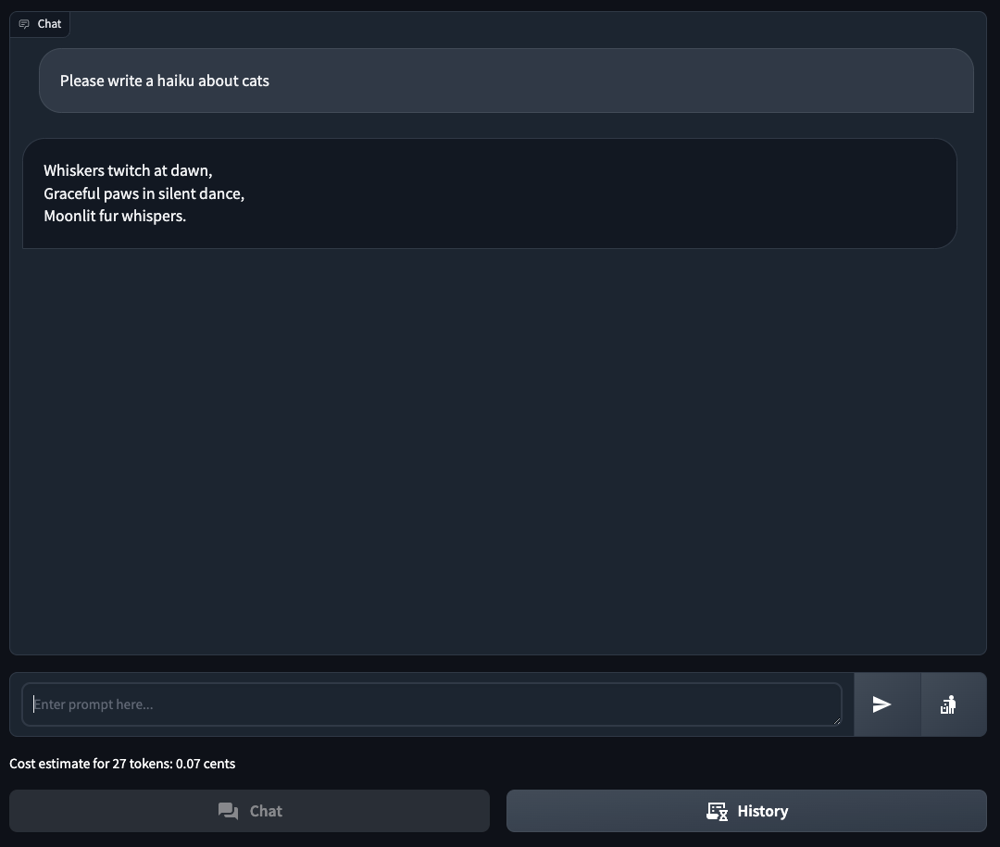
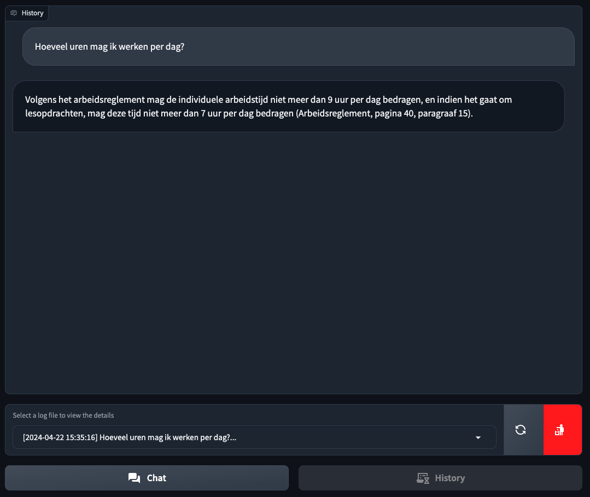

# TransformAI LLM Chat

## What's in this repository?
This repository contains some "chatbot" and related examples using the _Azure OpenAI_ as the LLM under the hood:
- `demos/basic_chat` a basic chat app using the OpenAI "Completions API" (and a similar example with OpenRouter)
- `demos/rag` tools and utilities to showcase RAG using ChromaDB
- `chat_with_rag` a more fleshed out chat app using the OpenAI "Assistant API", including RAG and a chat history viewer
- `demos/slack` demo code for a Slack bot (with LLM integration)
- `class_based` the stub for refactoring these demos into more modular, reusable code (work in progress) 

## Configuration
To install the necessary libraries use `pip install -r requirements.txt`

Please create an `.env` file with the same structure as the provided `.env.example` file, 
and enter your personal (Azure OpenAI) **key** and **endpoint** therein.

## Use
Run the python script from the terminal (or your IDE). 

It will print out a **URL** to the console. 
The default URL is http://127.0.0.1:7860, which is running local only. 
To create a publicly accessible link, set `share=True` in the Gradio `launch()` call.

Surf to the generated address in your browser to use the Gradio web UI

## Screenshots

### chat.py
`./demos/basic_chat`

### launch_ui.py
`./chat_with_rag`

## License
Icons by <a target="_blank" href="https://icons8.com">Icons8</a>
