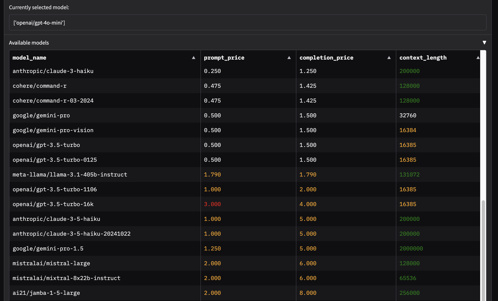

# Model Choice Demo

## What's in this folder?
This folder contains a basic chatbot example where you can choose **which LLM you interact with**.

- `chat_with_model_choice.py`: A basic chat app using OpenRouter.

- `or_pricing.py`: A utility script that queries the OpenRouter API for information on available models and filters them based on certain criteria (e.g., context length, pricing). You can modify this script to include or exclude specific types of models. The results are also saved to `or_pricing.csv`.

## Configuration

To install the necessary libraries, use `pip install -r requirements.txt`

Please create an `.env` file with the same structure as the provided `.env.example` file, and enter your personal **API key** therein.

## Use

1.  Run the `chat_with_model_choice.py` script from the terminal (or your IDE). This will start a Gradio interface.
2.  To switch to another LLM provider, click any of the rows in the "_Available models_" list. You can sort the list by name, price, or context length.

_For more info regarding how Gradio works, please refer to the general README in this repository._

## Screenshots

`chat_with_model_choice.py`

