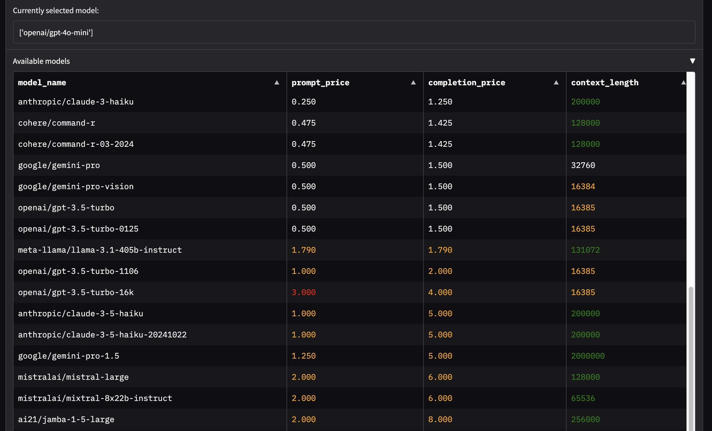

# Model Choice Demo

## What's in this folder?
This folder contains a basic chatbot example where you can choose **which LLM you interact with**.

- `chat_with_model_choice.py`: A basic chat app using OpenRouter. The "_Available models_" list blends OpenRouter's pricing with an LM Arena quality score (see below) to show an "LM Arena Score", a raw "Cost Estimate" (80% prompt price + 20% completion price), and a "Scaled Cost Estimate" (that cost, scaled down for higher-quality models and up for lower-quality ones) per model.

- `lmarena_download.py`: Downloads an LM Arena leaderboard snapshot (`overall` category) from the official [lmarena-ai/leaderboard-dataset](https://huggingface.co/datasets/lmarena-ai/leaderboard-dataset) on Hugging Face, and saves it as `lmarena_<subset>_<date>.csv`. Run it whenever you want to refresh the scores:
  ```bash
  python3 lmarena_download.py --subset text_style_control   # default
  python3 lmarena_download.py --subset webdev
  python3 lmarena_download.py --subset agent
  ```
  `chat_with_model_choice.py` picks up whichever CSV matches its `LMARENA_SUBSET` constant (loads the most recent dated file for that subset). Only one subset is used at a time — they're on different scales and aren't blended.

- `lmarena_scoring.py`: Shared logic (not a script you run directly) for matching OpenRouter model ids to LM Arena entries and computing the cost columns above. Used by both `chat_with_model_choice.py` and `build_model_report.py`.

- `build_model_report.py`: Fetches fresh OpenRouter pricing and an LM Arena snapshot, and writes a single combined CSV report (`or_lmarena_report.csv` by default) with pricing + LM Arena score + cost estimate columns — useful for browsing/filtering the full picture in a spreadsheet rather than the in-app dropdown (which caps prices and context length for a more manageable list). Also (re)generates `or_models.csv` and `lmarena_<subset>_<date>.csv` as a side effect.
  ```bash
  python3 build_model_report.py                        # text_style_control, -> or_lmarena_report.csv
  python3 build_model_report.py --subset webdev --out or_lmarena_webdev.csv
  ```

## Configuration

To install the necessary libraries, use `pip install -r requirements.txt`

Please create an `.env` file with the same structure as the provided `.env.example` file, and enter your personal **API key** therein.

Before first use (or whenever you want fresher scores), run `lmarena_download.py` to (re)generate the CSV for the subset configured in `chat_with_model_choice.py` (`LMARENA_SUBSET`, default `text_style_control`). Models OpenRouter doesn't have pricing for are skipped automatically (they never enter the OpenRouter-driven model list); OpenRouter models with no matching LM Arena score just show "N/A" for score/cost.

## Use

1.  Run the `chat_with_model_choice.py` script from the terminal (or your IDE). This will start a Gradio interface.
2.  To switch to another LLM provider, click any of the rows in the "_Available models_" list. You can sort the list by name, price, context length, LM Arena score, cost estimate, or scaled cost estimate.

_For more info regarding how Gradio works, please refer to the general README in this repository._

## Screenshots

`chat_with_model_choice.py`


