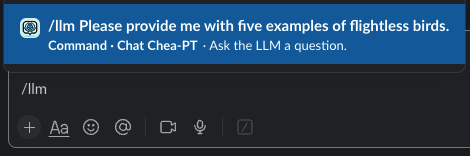

# Slack Chatbot Demo

## What's in this folder?

This repository contains two proof-of-principle Slack bot examples using [Azure OpenAI](https://oai.azure.com/) and [OpenRouter](https://openrouter.ai/) as the LLM provider.

- `slack_aoa.py`: A simple Slack bot example where the bot will respond to any queries starting with `/llm` using Azure OpenAI.

- `slack_or_with_tool_calling.py`: A similar example using OpenRouter, and includes tool calling capabilities. This bot can leverage external tools for tasks like web search and documentation lookup.

## Configuration

To install the necessary libraries, use `pip install -r requirements.txt`

Please create an `.env` file with the same structure as the provided `.env.example` file, and enter your personal LLM provider **API key** and **endpoint** therein, as well as your Slack **app token** and **bot token**. The `slack_aoa.py` script requires Azure OpenAI credentials, while `slack_or_with_tool_calling.py` requires OpenRouter credentials. Both scripts require Slack app and bot tokens.

## Use

1.  Create a Slack App and obtain the necessary tokens.
2.  Set up your `.env` file with the required credentials.
3.  Run the Python script from the terminal (or your IDE). For example: `python slack_aoa.py` or `python slack_or_with_tool_calling.py`.
4.  Add the bot to a channel or message it directly.
5.  If configured correctly, you will be able to interact with the bot in your channels using the `/llm` command.

## Notes

The `slack_or_with_tool_calling.py` script utilizes tool calling, allowing the bot to perform actions such as searching the web or retrieving information from documentation.

## Screenshots

## Documentation

-   [Create a Slack App](https://api.slack.com/apps?new_app=1)
-   [Slack Bolt for Python](https://slack.dev/bolt-python/getting-started/)
-   [Slack "slash" commands](https://api.slack.com/interactivity/slash-commands)
